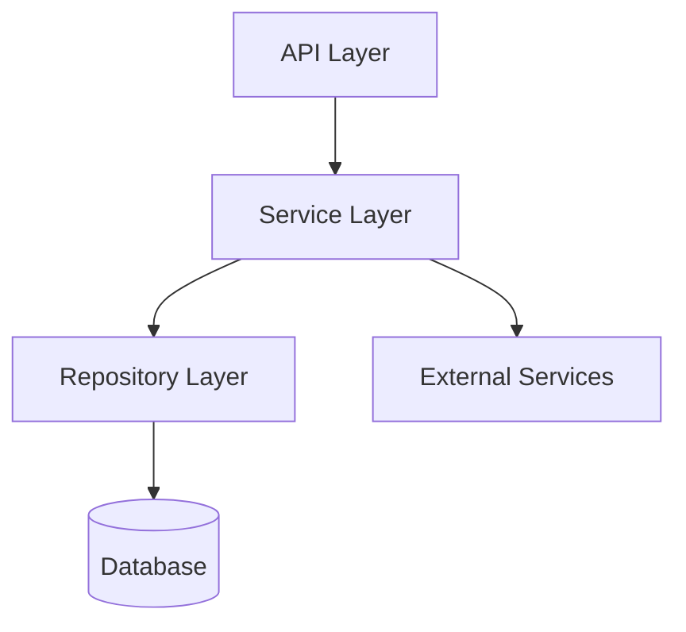

# Code Architect Skill — Kod Mimarı

## Temel Kural
> Mimari karar verme kodlama başlamadan önce gelir. Sonradan yapılan mimari değişiklikler pahalıdır.

---

## Mimari Süreç

### Adım 1 — Gereksinimleri Anla
```
Fonksiyonel Gereksinimler:
- Sistem ne yapacak?
- Hangi girdileri alacak, ne çıkaracak?
- Hangi kullanım senaryoları var?

Non-Fonksiyonel Gereksinimler:
- Performans hedefi (latency, throughput)?
- Ölçeklenebilirlik ihtiyacı?
- Güvenilirlik (availability, durability)?
- Güvenlik gereksinimleri?
- Bakım kolaylığı?
```

### Adım 2 — Modülleri Tanımla (Separation of Concerns)

İyi bir modül ayrışımı şu özelliklere sahiptir:
- **Yüksek iç bütünlük (cohesion)**: Modül içindeki şeyler birbirine ait
- **Düşük bağımlılık (coupling)**: Modüller arası bağımlılık minimize
- **Tek sorumluluk**: Her modülün değişme nedeni yalnızca biri
- **Açık arayüz**: Modülün dışarıya sunduğu API net

### Adım 3 — ADR (Architecture Decision Record) Yaz

Her önemli mimari karar için:

```markdown
## ADR-XXX: [Karar Başlığı]

**Tarih**: YYYY-MM-DD
**Durum**: Önerilen | Kabul Edildi | Revize Edildi | Reddedildi

### Bağlam
[Neden bu karar gerekli? Hangi problemi çözüyor?]

### Seçenekler Değerlendirildi
1. [Seçenek A]: Artı: [...] Eksi: [...]
2. [Seçenek B]: Artı: [...] Eksi: [...]

### Karar
[Hangi seçenek seçildi ve neden?]

### Sonuçlar
**Olumlu**: [...]
**Olumsuz / Trade-off**: [...]
**Riskler**: [...]
```

---

## Tasarım Deseni Seçim Rehberi

```
Problem: Nesne oluşturma nasıl yönetilsin?
└── Factory, Builder, Singleton

Problem: Nesneler arası iletişim nasıl düzenlenmeli?
└── Observer, Mediator, Command

Problem: Algoritma nasıl değiştirilebilir yapılsın?
└── Strategy, Template Method, State

Problem: Var olan sisteme davranış nasıl eklenmeli?
└── Decorator, Adapter, Proxy

Problem: Karmaşık sistem nasıl basitleştirilmeli?
└── Facade, Adapter

Problem: Büyük nesne ağacı nasıl işlenmeli?
└── Composite, Visitor
```

---

## Mimari Kontrol Listesi

Mimari tasarım tamamlanmadan önce:

**Modüller**
- [ ] Her modülün sorumluluğu tek cümleyle ifade edilebilir mi?
- [ ] Modüller arası döngüsel bağımlılık var mı?
- [ ] Public interface minimum tutuldu mu?

**Teknoloji**
- [ ] Teknoloji seçimi gereksinimlere göre mi yapıldı, alışkanlığa göre mi?
- [ ] Bağımlılıkların bakım durumu kontrol edildi mi?
- [ ] Lisans uyumluluğu var mı?

**Ölçeklenebilirlik**
- [ ] Darboğaz (bottleneck) noktaları belirlendi mi?
- [ ] Yatay / dikey ölçekleme mümkün mü?

**Güvenlik**
- [ ] Güven sınırları (trust boundaries) tanımlandı mı?
- [ ] Kimlik doğrulama / yetkilendirme stratejisi?

---

## Çıktı Formatı

Her mimari çalışma şunu üretmeli:
1. `ARCHITECTURE.md` — Güncel sistem mimarisi
2. `docs/adr/` altında ADR dosyaları
3. Modül bağımlılık diyagramı (Mermaid)


